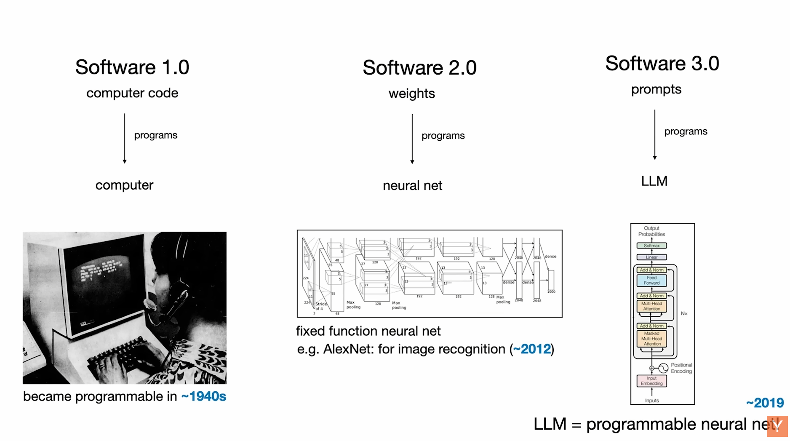
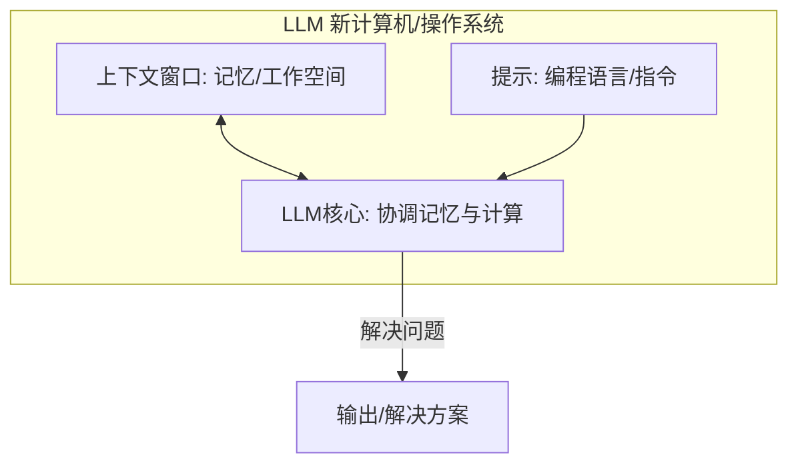
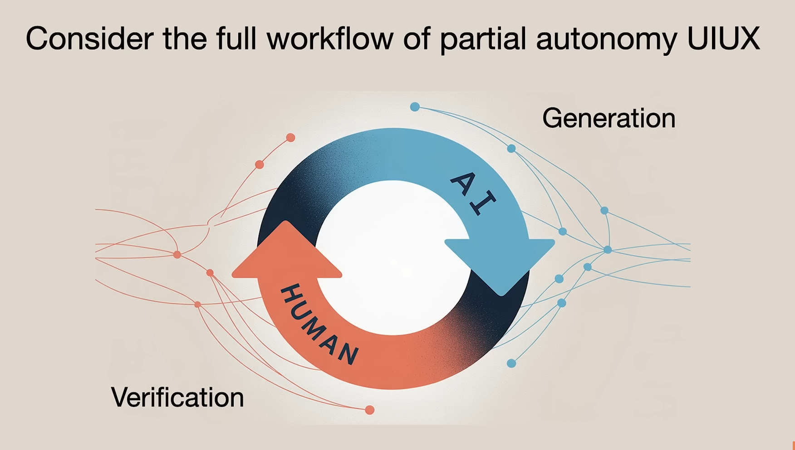

## 引言：

在过去几年中，软件世界经历了前所未有的剧变。前特斯拉人工智能总监安德烈·卡帕西（Andrej Karpathy）的演讲揭示了这一根本性变革，将软件的演进划分为三个阶段：从传统的代码编写（软件1.0）到神经网络权重（软件2.0），再到如今通过大型语言模型（LLM）提示进行编程（软件3.0）。

------

### **正文：软件正在（再次）变革：AI时代的软件发展与机遇**

安德烈·卡帕西认为，软件正在经历一场革命性的转变。在经历了数十年的稳定之后，我们正目睹软件领域发生两次快速而根本性的变化，这为整个行业带来了大量新的工作和重写现有代码的机会。他将这一演进过程清晰地划分为三个范式：

#### **1. 软件范式的演进：从代码到权重再到提示**



- **软件1.0：程序员编写的代码** 这是我们最熟悉的传统编程方式，程序员通过C++、Python等语言编写指令，控制计算机执行任务。GitHub是这类代码的主要存储库。例如，自动驾驶系统中早期的C++代码就属于这一范畴。
- **软件2.0：神经网络的权重** 这种软件不是直接编写的，而是通过调整数据集并运行优化器来“创建”神经网络的参数。AlexNet图像识别神经网络和特斯拉自动驾驶中用于图像识别的神经网络都是典型例子。随着神经网络能力的提升，许多功能从1.0迁移到2.0，甚至“所有的C++代码都被删除”。Hugging Face和Model Atlas则被比作软件2.0的“GitHub”。
- **软件3.0：通过LLM提示进行编程** 这是“一个全新的计算机类型”，令人惊讶的是，其编程语言竟然是“用英语写的”。卡帕西称这“完全改变了我对编程的看法”，并将其描述为“革命性的改变”。例如，情感分类任务现在可以通过提示大型语言模型来实现，而不仅仅是传统的Python代码或训练神经网络。软件3.0的出现意味着GitHub上的代码将不再仅仅是传统代码，还会“有很多英语的代码夹杂在一起”。卡帕西强调，未来的行业专业人士需要掌握所有这三种范式，因为它们各有优缺点，需要根据具体功能选择合适的编程方式。

#### **2. LLM的生态系统与特性：新的基础设施**

卡帕西深入探讨了LLM的本质及其在未来技术栈中的定位，提出了一些引人深思的类比：

- **LLM是新的电力/公用事业** “AI是新的电力”。OpenAI、Gemini等LLM实验室投入巨资训练LLM，这相当于“构建电网”。它们通过API提供智能服务，用户按令牌数量付费，并要求“低延迟、高可用性、一致的质量”。他认为，最先进的LLM崩溃时，就是“世界上的一种智力断电”。由于LLM作为软件不会在物理空间上竞争，因此可以有多个供应商，用户可以像选择电力供应商一样切换。

- **LLM是晶圆厂（Fabs）** 构建LLM的资本支出巨大，涉及“深度技术树”和集中在实验室内部的研发秘密。使用NVIDIA GPU进行软件开发类似于“fabulous模式”，而像谷歌训练TPU则类似于英特尔拥有自己的晶圆厂模式。

- LLM是新的操作系统

  卡帕西认为这是“最有意义的类比”。LLM不再是简单的商品，而是“越来越复杂的软件生态系统”。

  - **封闭源与开源**：类似Windows/macOS（封闭源）和Linux（开源），LLM也有竞争的封闭源提供商（如GPT、Claude、Gemini系列）和开源替代品（如Llama生态系统，可能成长为类似Linux的存在）。
  - **LLM即计算机**：“LLM是一种新的电脑”，其上下文窗口类似于内存，LLM协调内存和计算来解决问题。
  - **1960年代的计算**：LLM计算目前仍然非常昂贵，导致其集中在中央云中运行，用户通过网络交互，这类似于早期集中式、批处理的计算机时代。个人计算革命尚未到来，但未来可能会有本地LLM运行的趋势。
  - **文本终端交互**：直接与LLM对话，就像“通过终端与操作系统交谈”，目前的GUI尚未完全适应这种新的交互方式。
  - **技术扩散方向的反转**：通常新技术（如电力、互联网）首先被政府和公司采纳，然后才扩散到消费者，但LLM则相反，消费者率先使用，而公司和政府在采纳上“落后于我们所有人”。

#### **3. LLM的心理学与挑战：理解这些“随机模拟的人”**

LLM作为新计算机/操作系统示意图：



理解LLM的“心理学”至关重要，因为它们是“随机模拟的人，精神”。这些模拟器通过互联网文本训练，因此展现出“人类般的涌现心理学”。

- 超能力与认知缺陷的结合：
  - **超能力**：LLM拥有“百科全书般的知识和记忆”，能记住比任何人类都多的信息，类似于电影《雨人》中的自闭症天才。
  - 认知缺陷：
    - **幻觉**：“它们经常出现幻觉，它们编造东西”。
    - **自我认知不足**：自我认知不够好，但正在改善。
    - **锯齿状智能**：在某些解决问题领域超越人类，但会犯“基本没有人会犯的错误”（如9/11大于9.9，草莓有两个r），有“粗糙的边缘”。
    - **顺行性遗忘症**：LLM不原生支持长期学习和知识巩固，上下文窗口就像工作记忆，每次交互都需要重新编程，类似于电影《记忆碎片》和《五十一》中主角记忆每天重置的情况。
- **安全与欺骗**：LLM“非常容易受骗”，存在“提示注入”风险，并可能“泄露您的数据”。 总结来说，LLM是“超凡能力”与“许多认知缺陷和问题”的结合，关键在于如何编程它们以克服缺陷并利用其能力。

#### **4. LLM时代的应用机遇与最佳实践：与AI共建未来**

卡帕西分享了他认为最大的机会和构建LLM应用的最佳实践：

- 部分自主应用程序

  他最兴奋的是“部分自主应用程序”（Partially Autonomous Applications）。例如，Cursor（AI辅助编程工具）整合了传统界面与LLM，协调多次LLM调用，具有GUI进行人类审计，并提供“自主度滑块”。

  - **GUI的重要性**：GUI（图形用户界面）对于LLM应用至关重要，因为“文本很难阅读、解释、理解”，而GUI“利用了我们的计算机视觉”，“是一种通往大脑的高速公路”，有助于“人类审计这些系统错误并提高效率”。
  - **生成-验证循环**：AI负责生成，人类负责验证。关键在于“使这一循环尽可能快”，以便“能完成大量工作”。

  

  LLM应用中的“生成-验证循环”示意图：

  ```mermaid
  graph TD
      A[人类输入/任务] --> B[AI 生成响应/草案]
      B --> C{人类审计/验证?}
      C -- 是 --> D[人类确认/修正]
      C -- 否 --> E[人类修改提示/指导]
      D --> F[完成任务/输出]
      E --> B
  ```

  - **保持AI可控**：强调“我们需要让AI保持在控制之下”，避免代理过于活跃。特斯拉自动驾驶的经验表明，完全自动驾驶的普及将是一个漫长的过程，可能是“代理人的十年”，而不是一年。卡帕西用“钢铁侠盔甲”类比，认为未来是“增强和托尼·斯塔克的结合”。

- **“生活编程”（Programming in English）与每个人都是程序员** 由于LLM可以用英语编程，这创造了一种“自然接口”，意味着“突然之间，每个人都是程序员”。这是一种“完全前所未有的情况”，打破了传统编程的学习门槛。孩子们通过AI辅助进行编程的视频，展示了“未来是伟大的”。卡帕西本人也分享了用LLM辅助开发iOS应用和“Menu Gen”应用的经历，即使不懂Swift也能快速构建基础应用。

- 为代理（Agents）构建基础设施

  卡帕西指出，现在出现了一类新的“数字信息的操纵者”——代理（Agents）。“代理是他们的电脑”，但它们“很人性化”。

  - **代理友好型文档**：类似robots.txt，可以有llm.txt文件，以简单的Markdown格式告知LLM域名内容，这比解析HTML更有效。Vercel和Stripe等公司正在将文档转化为LLM友好的Markdown格式，甚至改变内容以适应LLM代理的执行方式（如将“点击”指令替换为curl命令）。
  - **LLM友好型工具**：例如，“Get Ingest”可以将GitHub仓库URL转化为一个巨大的文本，并创建目录结构，方便LLM读取；“Deep Wiki”不仅提供文件内容，还对GitHub仓库进行分析，为LLM生成定制化的页面，方便LLM复制粘贴内容。满足LLM的信息获取需求非常值得，因为直接使用LLM获取信息仍然昂贵且困难。

### **5. 结论：软件行业的新黄金时代**

卡帕西总结道，现在是进入软件行业的一个“绝佳时机”。我们“需要重写大量的代码”。LLM作为公用事业和操作系统，虽然仍处于早期（1960年代的计算时代），但其能力将不断增长。我们需要学会与“有缺陷”的LLM合作，并调整基础设施以适应它们。在构建LLM应用时，应注重快速的生成-验证循环和部分自主产品，并考虑产品的自主度滑块。未来，大量代码将由人类和LLM共同编写，同时也要为代理直接编写。他引用钢铁侠套装的类比，预示在未来十年中，软件的自主性将不断提高。我们正处在一个激动人心的时代，共同建设未来。