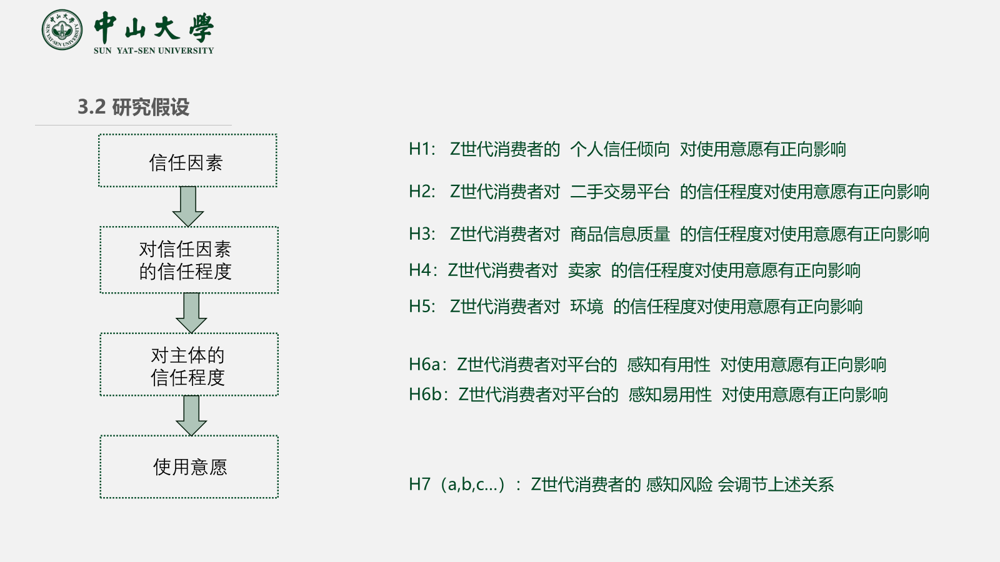
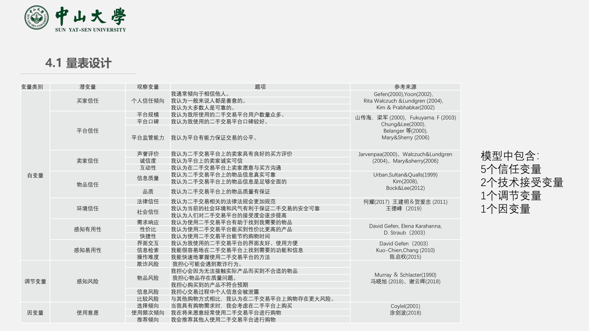
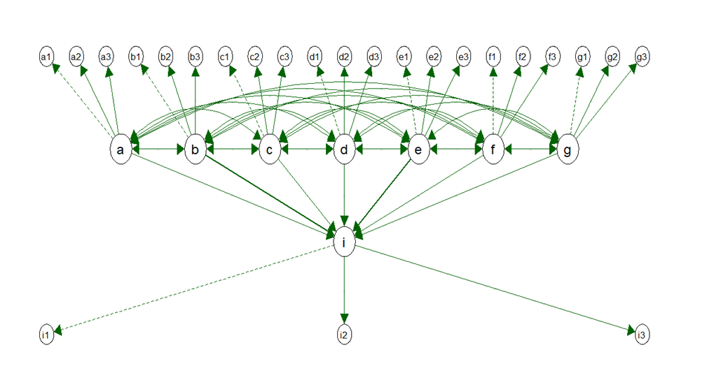

## Situation

项目来源于《研究方法与论文写作》课程作业

在共享经济与移动互联网的浪潮下，二手交易平台迅速发展，有效盘活了社会闲置资源，并满足了消费者对高性价比商品的需求。

本项目聚焦于Z世代（1995-2009年出生）这一核心用户群体。他们作为数字原住民，消费行为呈现出受社交媒体影响大、体验驱动、关注可持续性等独特之处。然而，信任缺失始终是制约二手交易平台发展的核心障碍。因此，本研究旨在深入探究影响Z世代用户使用意愿的关键因素，特别是多维度的信任机制，以及感知风险在其中扮演的调节角色 。

## Task 

核心任务是独立完成一次完整的实证研究，具体目标是：
* **构建理论模型**：梳理相关文献，基于技术接受模型（TAM）与网络信任理论，构建提出一个能够解释Z世代用户行为的理论模型及研究假设 。
* **设计研究工具**：根据理论模型，设计一份包含30个观测题项的李克特量表，以测量各潜变量 。
* **执行数据分析**：运用统计模型对收集到的271份有效问卷数据进行处理、检验和分析 。
* **撰写成果报告**：完成最终学术报告与汇报材料的撰写，整合研究全流程与核心发现 。

## Action

### 1. 理论基础与研究设计
首先对相关理论进行深入研究，研究框架主要借鉴了Lee & Turban (2001)的信任四因素模型和Gefen et al.的TAM整合模型。为保证内容效度，问卷量表题目均改编自成熟的学术文献。为确保问卷质量，对25名目标用户进行了预调研以验证信度。正式问卷通过问卷星平台发放，最终回收有效样本271份。

研究假设

量表设计

### 2. 数据分析

项目的全部数据分析使用R语言完成，保证过程的科学性与可复现性。

* **信度分析**
    我使用`psych`包计算各量表的克隆巴赫Alpha系数。结果显示，各变量Alpha系数均高于0.77，总量表Alpha系数高达0.969，信度极佳 。
    
    | 潜变量        | 买家信任 | 平台信任 | 卖家信任 | 物品信任 | 环境信任 | 感知有用性 | 感知易用性 | 感知风险 | 使用意愿 |
    | ------------- | -------- | -------- | -------- | -------- | -------- | ---------- | ---------- | -------- | -------- |
    | 题项数        | 3        | 3        | 3        | 3        | 3        | 3          | 3          | 6        | 3        |
    | 克隆巴赫Alpha | 0.825    | 0.792    | 0.821    | 0.842    | 0.790    | 0.778      | 0.838      | 0.832    | 0.825    |
    
* **效度分析**
    首先通过探索性因子分析（EFA）检验量表的结构，KMO值为0.974，Bartlett球形度检验显著，说明数据非常适合进行因子分析 。随后，通过验证性因子分析（CFA）对模型进行验证。
    
    EFA结果
    
    | KMO取样适切性量数      | 0.974    |               |
    | ---------------------- | -------- | ------------- |
    | **Bartlett球形度检验** | 近似卡方 | 99.60347      |
    |                        | 自由度   | 29            |
    |                        | 显著性   | 1.132139e^0.9 |
    
    CFA分析结果
    
    | 指标                           | 结果       | 是否符合标准 |
    | ------------------------------ | ---------- | ------------ |
    | chisq/df（拟合优度的卡方检验） | 1.5769     | 符合         |
    | GFI（拟合优度指数）            | 0.9279     | 符合         |
    | AGFI（调整拟合优度指数）       | 0.8954     | 符合         |
    | CFI（比较拟合指数）            | 0.9721     | 符合         |
    | TLI（Tucker-Lewis 指数）       | 0.9656     | 符合         |
    | RMSEA（近似误差均方根）        | 0.04614014 | 符合         |

* **结构方程路径分析**
    使用`lavaan`包构建了完整的结构方程模型，以检验各信任维度和TAM变量对使用意愿的影响。

    

    结构方程路径示意图

    

路径分析结果

| **路径**                | **路径系数估计值** | **标准化估计值** | **回归抽样分布的标准误差** | **T值** | **P值** |
| ----------------------- | ------------------ | ---------------- | -------------------------- | ------- | ------- |
| 买家信任 ->  使用意愿   | 0.329              | 0.357            | 0.0128                     | 8.393   | ***     |
| 平台信任 ->  使用意愿   | 0.229              | 0.185            | 0.0135                     | 5.692   | ***     |
| 卖家信任 ->  使用意愿   | 0.362              | 0.253            | 0.0108                     | 4.244   | ***     |
| 物品信任 ->  使用意愿   | 0.227              | 0.187            | 0.0433                     | 2.946   | **      |
| 环境信任 ->  使用意愿   | 0.054              | 0.072            | 0.0411                     | 1.433   | 0.123   |
| 感知有用性 ->  使用意愿 | 0.378              | 0.339            | 0.0152                     | 6.753   | ***     |
| 感知易用性 ->  使用意愿 | 0.212              | 0.197            | 0.0167                     | 4.826   | ***     |

主效应假设检验结果

| 编号 | 假设内容                                                    | 检验结果 |
| ---- | ----------------------------------------------------------- | -------- |
| H1   | Z世代消费者的 个人信任倾向   对使用意愿有正向影响           | 成立     |
| H2   | Z世代消费者对 二手交易平台   的信任程度对使用意愿有正向影响 | 成立     |
| H3   | Z世代消费者对 商品信息质量   的信任程度对使用意愿有正向影响 | 成立     |
| H4   | Z世代消费者对 卖家   的信任程度对使用意愿有正向影响         | 成立     |
| H5   | Z世代消费者对 环境   的信任程度对使用意愿有正向影响         | 不成立   |
| H6a  | Z世代消费者对平台的 感知有用性   对使用意愿有正向影响       | 成立     |
| H6b  | Z世代消费者对平台的 感知易用性   对使用意愿有正向影响       | 成立     |

* **调节效应分析 (Moderation Analysis)**
    为检验感知风险的调节作用，将样本分为高、低风险感知两组，并进行多群组路径分析，对比各路径系数的差异显著性 。

系数的差值 的正负表示该变量在哪个组的影响作用更大，Ｔ值的差异表示变量路径系 数的差异是否存在统计学意义上的显著性

| 路径                     | 系数差异 | T差值  | 检验结果          |
| ------------------------ | -------- | ------ | ----------------- |
| 买家信任 -> 使用意愿     | -0.067   | 2.14   | 感知风险强>弱     |
| 平台信任 -> 使用意愿     | -0.05    | -2.475 | 感知风险弱>强     |
| 商品信息质量 -> 使用意愿 | -0.185   | -2.016 | 感知风险弱>强     |
| 卖家信任 -> 使用意愿     | -0.004   | -2.392 | 感知风险弱>强     |
| 感知有用性 -> 使用意愿   | -0.2     | -2.288 | 感知风险弱>强     |
| 感知易用性 -> 使用意愿   | -0.136   | -2.877 | 感知风险弱>强  == |

调节效应分析结果

| 编号 | 假设内容                                                 | 检验结果 |
| ---- | -------------------------------------------------------- | -------- |
| H7a  | 感知风险对 买家信任 与 使用意愿 之间关系的调节作用显著   | 成立     |
| H7b  | 感知风险对 平台信任 与 使用意愿 之间关系的调节作用显著   | 成立     |
| H7c  | 感知风险对  卖家信任 与 使用意愿 之间关系的调节作用显著  | 成立     |
| H7d  | 感知风险对 物品信任 与 使用意愿 之间关系的调节作用显著   | 成立     |
| H7e  | 感知风险对 环境信任 与 使用意愿 之间关系的调节作用显著   | 不成立   |
| H7f  | 感知风险对 感知有用性 与 使用意愿 之间关系的调节作用显著 | 成立     |
| H7g  | 感知风险对 感知易用性 与 使用意愿 之间关系的调节作用显著 | 成立     |

## Result 

项目成功验证了大部分研究假设，并得出了具有理论与实践价值的结论。

* **模型拟合度**
    最终的结构方程模型拟合度良好（χ²/df = 1.680, CFI = 0.927, TLI = 0.976, RMSEA = 0.076），表明模型对数据的解释力强 。

* **假设检验结果**
    研究的主要发现清晰地展示了影响Z世代使用二手平台的关键驱动力。
    
    | 假设编号 | 关系路径 | 检验结果 |
    | :--- | :--- | :---: |
    | H1 | 买家信任 -> 使用意愿 | **成立**  |
    | H2 | 平台信任 -> 使用意愿 | **成立**  |
    | H3 | 物品信任 -> 使用意愿 | **成立**  |
    | H4 | 卖家信任 -> 使用意愿 | **成立**  |
    | H5 | 环境信任 -> 使用意愿 | *不成立*  |
    | H6a | 感知有用性 -> 使用意愿| **成立**  |
    | H6b | 感知易用性 -> 使用意愿| **成立**  |
    | H7a-d,f,g | 感知风险的调节作用 | **成立**  |
    | H7e | 感知风险对(环境信任->意愿)的调节 | *不成立*  |
    
* **核心结论**
    1.  **多维信任是基石**：对买家、平台、卖家、物品的信任，均显著正向影响使用意愿 。
    2.  **“有用”是关键**：在所有因素中，**感知有用性**（路径系数0.378）和**买家个人信任倾向**（路径系数0.329）的影响最大 。
    3.  **风险改变决策逻辑**：感知风险的调节作用显著。在高风险感知下，**买家个人信任**的影响更突出；而在低风险感知下，**平台和卖家的可靠性、产品信息的质量**等外部因素更为重要 。

## Reflection

1.  **方法论反思与迭代**
    SEM的选择被证明能有效检验本研究的复杂理论模型。然而，模型的简洁性也意味着潜在的变量遗漏。未来的迭代可以考虑纳入**社交影响**等二阶或调节变量，以探索更复杂的交互效应。对于“环境信任”的不显著，后续研究应进一步区分其是源于Z世代的群体特性，还是平台内部信任机制的替代效应。

2.  **研究设计的局限与优化**
    本研究采用了横截面数据，这限制了对变量间因果关系的推断。虽然SEM提供了路径方向的理论假设，但要更有效地确立因果关系，未来的研究可采用**纵向研究设计**或**实验法**。此外，结合**定性访谈**能更深入地解释定量数据背后的“为什么”，使研究结论更饱满。

3.  **样本代表性与外部效度**
    当前样本的同质性（以中国学生为主）可能限制了研究结论的**外部效度**。为验证模型的普适性，未来的研究亟需进行**跨文化、跨群体**的重复验证，例如，比较不同国家或不同职业背景的Z世代群体，以增强研究结论的稳健性与推广价值。