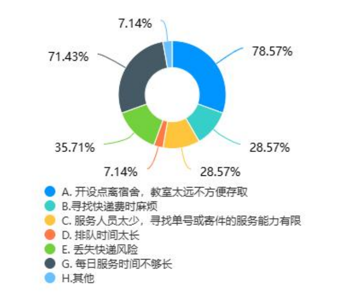
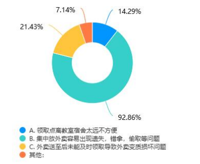
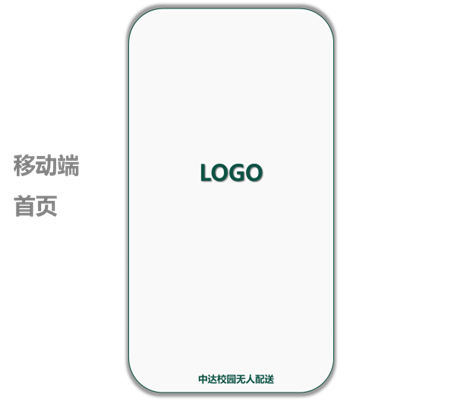
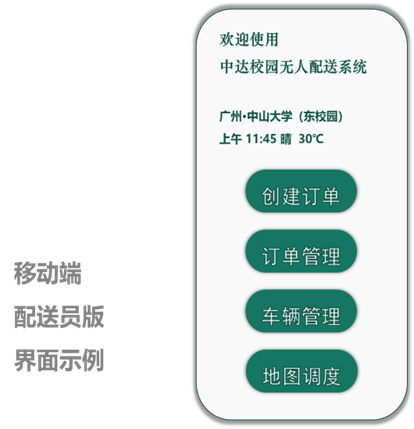
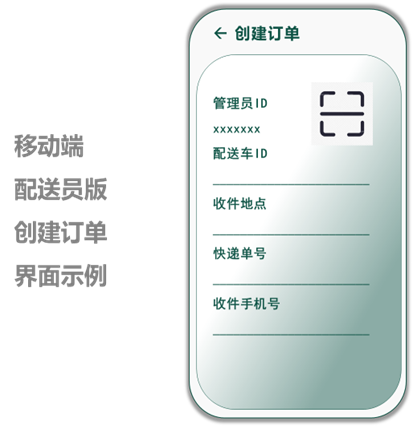
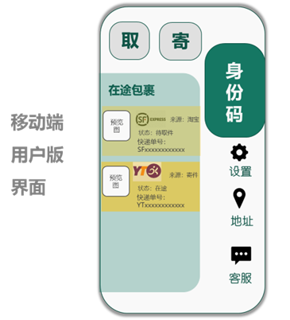
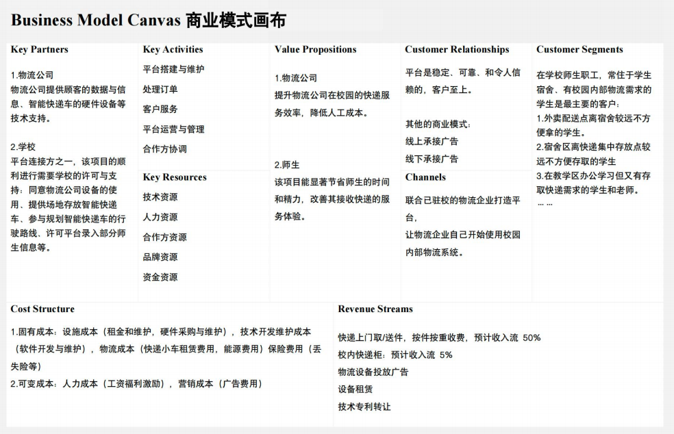

## Situation

在当今高校，随着电商和外卖的普及，校园内部的“最后一公里”物流已成为一个显著的效率瓶颈。作为项目发起人，我们观察到并定义了以下核心问题：

1.  **空间与时间错配**：快递驿站、外卖柜通常设置在固定地点，与学生的宿舍、教学楼、图书馆等高频活动区域存在较远距离。取件耗时（平均>15分钟）、服务时间受限（例如晚上7点后关闭），给师生带来极大不便。
2.  **体验差与风险高**：取件高峰期需长时间排队，在海量包裹中“寻宝”式查找体验糟糕。传统人工跑腿服务则存在人员杂乱、物品丢失、隐私泄露等安全隐患。
3.  **运营效率低下**：对于物流公司而言，末端配送的人力成本高昂，且效率难以提升。对于校园管理方，大量配送人员和车辆也带来了管理压力。

**核心用户画像 (User Persona):**

*   **“宅”系学生 (小张)**：重度网购用户，希望包裹能以最便捷的方式送达宿舍楼下，不愿意为取件花费大量时间，对价格敏感。
*   **科研达人 (王老师)**：常在实验室工作至深夜，需要寄送紧急文件或收取实验器材，但驿站早已关门，对服务的即时性和可靠性要求高。
*   **物流站点运营者**：面临高峰期人力短缺和成本压力，希望通过技术手段降本增增效。

## Task

我们的任务是设计一个可行的、技术驱动的产品解决方案，以解决上述校园物流痛点。作为产品负责人，我为项目设定了以下分层目标：

1.  **用户价值目标**：为校园师生提供一个**便捷、高效、安全**的无人化按需配送服务，显著降低取件的时间成本和心理负担。
2.  **商业价值目标**：为物流合作方提供一套**低成本、高效率**的末端运力补充方案，并探索可持续的盈利模式。
3.  **产品核心指标 (North Star Metric)**：**日均成功配送订单数**。这个指标直接反映了产品的用户采纳度、运营效率和整体价值。

我们的最终交付物是一份完整的产品需求文档(PRD)和商业可行性报告，用于争取校方支持和初期投资。

## Action

我们遵循了从研究到设计，再到规划的标准化产品开发流程。

### 1. 用户研究与需求分析

我们没有停留在表面观察，而是通过定量和定性研究来验证和深化我们的假设。

*   **定量问卷**：发放并回收了数百份有效问卷，关键数据发现如下：
    *   `78.57%` 的用户认为“驿站离宿舍/教室太远”是首要痛点。
    *   `71.43%` 的用户抱怨“服务时间不够长”。
    *   **外卖配送**中，`92.86%` 的用户担心“集中存放导致外卖错拿/丢失”。

*   **定性访谈**：与10余位学生和2位后勤老师进行深度访谈，挖掘了**紧急文件配送**、**跨校区物品流转**等潜在的、更高价值的需求场景。

这些数据直接支撑了我们的产品决策，证明了这是一个**真实存在且高频**的痛点，用户有明确的改善意愿。





### 2. 产品定义与 MVP 设计

基于用户研究，我们将解决方案定义为一个连接**用户端、运力端（无人车）、调度端**的智能配送平台。

`````mermaid
sequenceDiagram
    actor 用户
    participant 小程序
    participant 后端服务器
    participant 无人车

    Note over 无人车,后端服务器: 车辆已按路线到达指定停靠点
    无人车->>后端服务器: 报告: 已到达坐标 (x, y)
    后端服务器->>小程序: Push通知: 您的配送已到达
    小程序->>用户: 显示“车辆已达”提醒

    用户->>小程序: 点击“开柜取货”按钮
    小程序->>后端服务器: API请求: 验证用户并开柜 (含用户ID, 订单ID)
    
    activate 后端服务器
    Note over 后端服务器: 验证用户身份和订单状态
    后端服务器->>无人车: 指令: 为订单(Order123)开锁
    deactivate 后端服务器

    activate 无人车
    Note over 无人车: 执行开锁指令, 弹开对应格口
    无人车-->>用户: (物理)格口弹开
    deactivate 无人车

    用户->>无人车: (物理)取走包裹
    
    activate 无人车
    Note over 无人车: 红外/重力传感器检测到格口已空
    无人车->>后端服务器: 报告: 订单(Order123)已取件, 格口关闭
    deactivate 无人车

    activate 后端服务器
    Note over 后端服务器: 更新订单状态为“已完成”
    后端服务器->>小程序: Push通知: 订单已完成
    deactivate 后端服务器
    
    小程序->>用户: 显示“订单已完成”界面
`````


**核心价值主张 (Value Proposition):**

*   **对用户**: “随时随地，一键呼叫，包裹/外卖送到楼下”。
*   **对物流公司**: “无人化运力补充，降低末端履约成本”。

**最小可行产品 (MVP) 范围:**

为了快速验证核心价值，我们定义的MVP聚焦于最核心的“**快递代取到楼**”场景。

| 模块 | 核心功能 (PRD-Style) | 用户故事 (As a... I want to... so that...) | 验收标准 |
| :--- | :--- | :--- | :--- |
| **用户端小程序** | 1. 扫码/手动下单<br>2. 订单状态实时追踪<br>3. 在线支付<br>4. 获取取货码 | 作为一个学生，我希望能输入快递信息并指定送达的宿舍楼，这样我就不用亲自去驿站了。 | 用户可以成功创建订单，并在地图上看到无人车的大致位置和预计到达时间。 |
| **无人配送车** | 1. 接收调度指令<br>2. 自动导航与避障<br>3. 多格口独立存储<br>4. 到达后语音/短信提醒 | - (硬件核心能力) | 车辆能按照规划路线行驶，在遇到障碍物时能安全停止或绕行。 |
| **调度后台** | 1. 订单聚合与智能派单<br>2. 车辆状态监控<br>3. 路线动态规划 | - (后台核心能力) | 运营人员可以在后台看到所有订单和车辆的实时状态，并能手动干预异常情况。 |

**精准取货方案**：我们设计了“人脸识别 + 动态取货码”的双重验证机制，解决了传统外卖柜“一码通开”的安全隐患，确保了取货的唯一性和安全性。


为了快速验证核心价值，我们定义了清晰的用户流程，并基于此设计了产品原型。

**用户流程图**

````mermaid
graph TD
    subgraph "用户下单阶段"
        A[用户收到快递/外卖取件通知] --> B{打开中达配送小程序};
        B --> C[选择“代取到楼”服务];
        C --> D[输入/扫描快递信息];
        D --> E[选择送达宿舍楼及预计时间];
        E --> F[确认订单并支付];
    end

    subgraph "系统处理与配送阶段"
        F --> G((系统派单));
        G --> H[运营人员装载包裹至无人车];
        H --> I[无人车按规划路线自动配送];
        I --> J[等待车辆到达...];
    end

    subgraph "用户取货阶段"
        J --> K{收到“车辆已达”短信/App通知};
        K --> L[用户前往楼下指定停靠点];
        L --> M[通过人脸识别或输入取货码验证];
        M --> N[对应格口自动弹开];
        N --> O[取走包裹];
        O --> P([订单完成]);
    end

    style F fill:#f9f,stroke:#333,stroke-width:2px
    style G fill:#bbf,stroke:#333,stroke-width:2px
    style M fill:#9f9,stroke:#333,stroke-width:2px
````

**运营人员流程图**

`````mermaid
graph TD
    A[运营人员在后台接收到新订单] --> B[在驿站货架上找到对应包裹];
    B --> C{扫描包裹条码};
    C --> D{扫描无人车空闲格口二维码};
    D --> E[系统后台自动绑定“订单-包裹-格口”];
    E --> F[将包裹放入指定格口];
    F --> G{是否还有待装载订单?};
    G -- 是 --> B;
    G -- 否 --> H[点击“完成装载并派车”];
    H --> I((系统规划最优配送路线));
    I --> J([无人车出发]);

    style E fill:#bbf,stroke:#333,stroke-width:2px
    style I fill:#bbf,stroke:#333,stroke-width:2px
`````

**核心设计理念：**

**简洁**： 界面设计简洁明了，操作流程清晰易懂，方便配送员及用户快速上手。

**实时反馈**： 用户可以实时查看订单状态和配送进度，并可以随时与客服联系。

**一站式服务**：不包含外部链接，集成平台信息，使用户可以在平台上获取各品牌物流信息及所有基础的寄送服务。

 

**配送员端界面**

配送员端界面主要面向负责无人配送车的运营和维护人员，提供创建订单、订单管理、车辆管理、地图调度等功能。

**主要功能模块**：

**创建订单**：扫码一键快捷填入配送车ID、收件地点、快递单号、收件手机号，力求提高配送员订单创建效率。

**订单管理**： 展示待配送订单信息，包括订单号、收件人、送达地点、送达时间等。

**车辆管理**： 展示所有无人配送车的实时位置、状态、电量等信息，方便配送员进行调度和管理。

**地图调度**：调用服务区域内的地图及实时道路信息，根据订单信息和车辆状态智能规划配送方案。

**界面示例**：

 

**用户端界面**

用户端界面主要面向校园师生，提供核心的取、寄快递，以及集成各物流公司物流信息的首页预览、身份码设置、用户设置、地址、客服反馈功能。

**主要功能模块**：

**取/寄**： 一键进入取/寄快递服务界面，简洁易用，属于核心功能

**在途包裹**： 显示集成各物流公司物流信息的预览界面，用户点击后可以具体查看实时订单状态，包括物流公司、来源、状态、快递单号等信息。

**身份码**：用户使用实名信息获取身份码用于寄件时代替身份证进行实名认证，需要人脸识别核对实名信息。

**客服**： 用户可以对配送服务进行评价和反馈，帮助平台优化服务。

**设置**： 用户在此处可以查看个人信息、订单历史，调整界面外观设置，修改权限等。

**地址**：存储用户的常用的地址信息，支持定位填写、一键粘贴和智能识别（从一段话中提取地址信息并填入），方便用户使用多地址。

**界面示例**：



## 3. 商业模式与 GTM 策略

*   **收入模式**:
    1.  **基础配送费** (To C)：按次收费，预计0.5-2元/单，作为主要收入来源。
    2.  **增值服务费** (To C)：如超时保管费、加急服务。
    3.  **广告费** (To B)：车身广告、小程序内广告位。
    4.  **技术服务/租赁费** (To B)：未来向其他机构输出解决方案。

*   **成本结构**: 主要为无人车折旧、技术研发与维护、运营人力成本。核心优势在于**边际成本极低**，规模效应明显。

*   **进入市场策略 (Go-To-Market)**:
    1.  **单点验证**：选择一个校区作为试点，与一家主流快递（如菜鸟）深度合作，跑通MVP。
    2.  **口碑传播**：通过首单免费、邀请有礼等方式，在学生群体中形成病毒式传播。
    3.  **模式复制**：在试点成功后，将成熟的模式快速复制到其他校区乃至大学城。

## Result

我们的行动最终产出了一套完整的、数据驱动的商业计划和产品蓝图。

1.  **清晰的产品路线图**：我们规划了从 MVP (快递代取) -> V1.1 (外卖配送) -> V1.2 (校园内即时配送) -> V2.0 (多校区网络) 的清晰迭代路径。
2.  **量化的财务预测**：基于对用户规模、下单频率和定价的保守估计，我们建立了财务模型。
    *   **投资回报**：NPV（净现值）在5%-20%的贴现率下**均为正数**，表明项目具备良好的投资潜力。
    *   **盈利预期**：预计在运营的**第3年**（2025年）实现年度净利润转正。
    *   **资产回报率(ROA)** 和 **净资产收益率(ROE)** 呈现逐年高速增长的健康态势。
    

附商业模式画布：



## Reflection

1. **更敏捷的验证，而非完美的计划**：商业计划书偏向“瀑布式”，试图一次性规划所有细节。我会更早地引入**敏捷开发**和**精益创业**思想。在投入重金购买或研发无人车之前，我会先做一个“**礼宾式MVP (Concierge MVP)**”——即用我们的小程序接单，然后**由团队成员人工配送**。这样可以用最低成本验证核心需求、价格敏感度和用户流程，快速收集反馈，迭代产品原型。

   ```mermaid
   graph LR
       subgraph "用户端 (不变)"
           A[用户收到取件通知] --> B[打开小程序下单并支付];
       end
   
       subgraph "MVP后端 & 人工履约 (核心变化)"
           B --> C((系统派单));
           C -- 指派给 --> D["兼职同学(人工运力)"];
           D --> E[同学前往驿站手动取件];
           E --> F[步行/骑车送至宿舍楼下];
           F --> G[电话/短信联系用户];
       end
       
       subgraph "交付 (人工)"
         G --> H[当面交付包裹];
         H --> I([订单完成]);
       end
   
       style D fill:#f96,stroke:#333,stroke-width:2px
       style F fill:#f96,stroke:#333,stroke-width:2px
       style H fill:#f96,stroke:#333,stroke-width:2px
   ```

2. **对技术风险的再评估**：我们对无人驾驶技术的实现过于乐观。在现实中，这部分的技术壁垒和成本极高。我会将技术方案调整为：**初期阶段，优先与成熟的第三方无人车供应商合作（如美团、百度），采用租赁或合作运营模式**，将重心放在打磨用户产品和运营体系上。待商业模式验证成功、现金流稳定后，再考虑自研硬件。

3. **数据埋点与A/B测试**：计划书中的数据分析多为宏观市场和财务数据。我会从产品设计之初就定义详细的**数据埋点方案**，追踪关键的用户行为漏斗（如下载->注册->下单->支付->完成），并设立**A/B测试**框架。例如，针对“配送费是1元还是1.5元？”这个问题，我们可以直接对不同用户群进行测试，观察转化率变化，用真实数据做出最优决策。

4. **重新定义核心壁垒**：项目的长期护城河不在于“拥有无人车”，而在于**高效的“人-车-货-场”智能调度系统**和**高密度的校园运营网络**。前者是技术壁垒，后者是规模壁垒。我会将研发资源更多地倾斜给调度算法和后台系统，因为这才是我们的核心竞争力。
