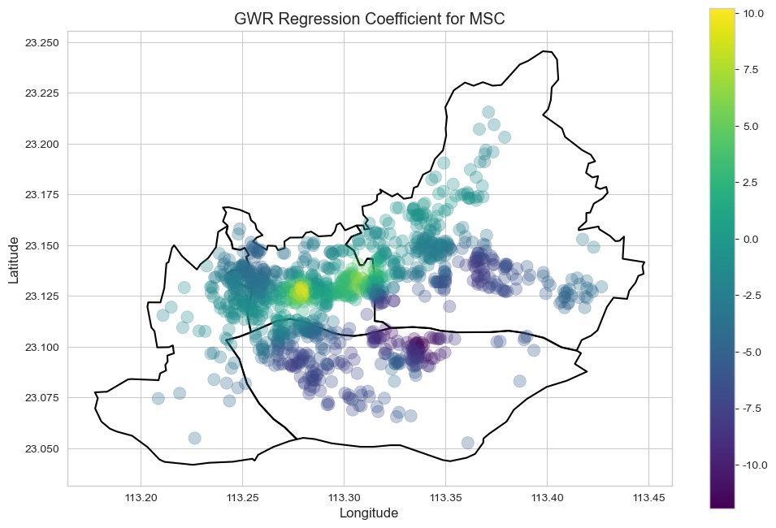
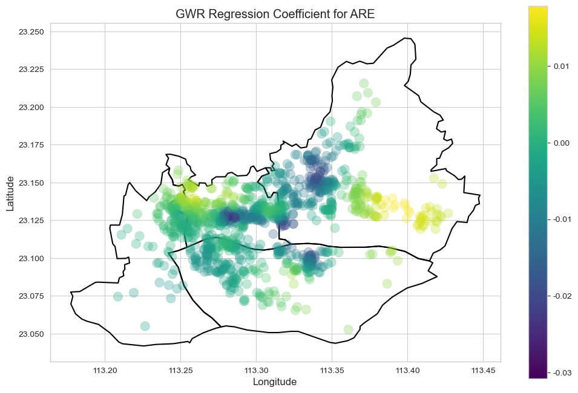

## Situation

> 本项目来源于中山大学管理学院2024秋学期《大数据与商业智能》与《计量经济学》课程的期末作业，基于多源数据进行了广州市中心城区的房价预测，在发现模型的预测能力普遍不佳后，基于GWR模型对房价的影响因素进行空间异质性分析，发现了多种影响因素在空间上的异质性，解释了基于普通机器学习模型的预测精度不佳的情况。
>
> 项目融合了数据采集、地理信息分析、机器学习和空间计量经济学等多种技术,最终产出了一份数据分析报告和一份实证论文。
>
> 项目仓库地址：https://github.com/Mariooo7/Canton-Housing-POI-Research
>
> 安居客房产数据爬虫项目仓库地址：[Mariooo7/anjuke_community_scraper: 安居客二手房小区网络爬虫](https://github.com/Mariooo7/anjuke_community_scraper)
>
> 报告：[Canton-Housing-POI-Research/report/基于多源大数据的广州市中心城区二手房市场分析与房价预测报告.md at master · Mariooo7/Canton-Housing-POI-Research](https://github.com/Mariooo7/Canton-Housing-POI-Research/blob/master/report/基于多源大数据的广州市中心城区二手房市场分析与房价预测报告.md)
>
> 论文：[Canton-Housing-POI-Research/paper/基于POI数据的房价影响因素空间异质性分析——以广州市中心城区为例.md at master · Mariooo7/Canton-Housing-POI-Research](https://github.com/Mariooo7/Canton-Housing-POI-Research/blob/master/paper/基于POI数据的房价影响因素空间异质性分析——以广州市中心城区为例.md)

房价预测是一个经典的数据科学问题，但传统的机器学习模型往往将所有样本一视同仁，忽略了一个关键维度：**空间**，也因此使得涉及空间维度的预测常常十分棘手。例如，“距离地铁站500米”这一特征，在公共交通完善的老城区与交通不便的新开发区，其对房价的正面影响强度显然是不同的。

这种现象被称为**空间异质性 (Spatial Heterogeneity)**，即变量之间的关系会随着地理位置的改变而发生变化。直接应用标准模型可能会得到一个整体表现尚可但无法解释局部市场动态的“黑箱”。本项目面临的核心挑战是，当发现了常规机器学习模型的预测效果不达预期时，如何量化和解释这种空间异质性，从而更深刻地理解房价背后的驱动逻辑和城建有代表性的大城市中心城区的房价影响因素特征。

## Task

为应对上述挑战，本项目设定了两个核心目标：

1.  **构建一个自动化的数据处理流水线**，能够整合多源异构数据（房产挂牌数据、POI兴趣点、GIS地理边界），并工程化生成一系列可量化的区位特征。
2.  **接续进行两条分析路线**：
    *   使用**机器学习模型**进行房价预测，并评估其全局预测能力与特征重要性。
    *   主要基于**地理加权回归（GWR）模型**分析房价影响因素空间异质性，揭示与证实标准模型无法捕捉的局部规律，解释其预测能力的局限性。

## Action

整个项目的执行流程分为两大阶段：自动化的数据处理与双轨制的建模分析。所有步骤都力求模块化、规范化。

### 阶段一：自动化数据处理与特征工程

此阶段的核心是 `run_pipeline.py` 脚本，它有序调用了 `src/` 目录下的所有处理模块，确保了从原始数据到干净分析数据集的端到端自动化。

**关键实现细节与效益说明**:

1.  **模块化与配置分离 (`run_pipeline.py` & `config.py`)**:
    *   **做法**: 将整个数据流拆分为9个独立的Python脚本，每个脚本负责一个明确的任务（如`geocoding.py`只管地理编码）。所有路径、API密钥、文件名和模型参数等易变项都集中在 `config.py` 文件中管理。
    *   **效益**: 极大地提升了项目的**可维护性**和**可复现性**。当需要修改某个步骤的逻辑（如更换API）或调整参数时，只需修改对应的模块或配置文件，无需改动主流程代码。

2.  **地理编码与坐标系校正 (`geocoding.py`)**:
    *   **做法**: 调用百度地图API将地址文本转为坐标后，并未直接使用，而是通过 `bd09_to_wgs84` 函数将其从百度自有的BD-09坐标系，经由国家标准的GCJ-02（火星坐标系），最终精确转换为国际通用的WGS-84坐标系。
    *   **效益**: 这是GIS分析中至关重要但常被忽略的一步。不同地图服务商的坐标系存在偏差，若不统一，会导致空间计算（如距离、缓冲区分析）出现米级甚至百米级的系统性误差，直接影响分析结果的准确性。

3.  **高效的POI距离计算 (`distance.py`)**:
    *   **做法**: 在计算每个小区到数千个POI（如地铁站）的最短距离时，放弃了效率低下的双重循环（暴力法，时间复杂度 O(N*M)）。取而代之，我们先使用 `sklearn.neighbors.BallTree` 对所有POI点的坐标构建空间索引树。然后，对每个小区点，在树上进行高效的最近邻查询。
    *   **效益**: 将计算复杂度从 O(N*M) 降低到约 O(N log M)。对于本项目数千小区和数万POI的场景，使计算时间从数小时缩短到**几秒钟**，使得大规模特征工程变得切实可行。

4.  **空间化特征构建 (`river.py`, `area.py`)**:
    *   **做法**: 使用 Python的地理数据分析库：`GeoPandas` 和 `Shapely` ，将抽象的“区位”概念量化。例如，通过 `geometry.buffer()` 创建小区周边的800米缓冲区，再用空间查询统计缓冲区内的商业设施面积，从而生成`ARE`（定义商业面积）特征。
    *   **效益**: 将简单的点数据升级为带空间维度的数据，能够进行更高级的地理空间分析，这是本项目区别于传统房价预测的关键。

5.  **生成双轨数据集 (`get_data_predict.py`, `get_data_research.py`)**:
    *   **做法**: 流水线最终输出两个不同的数据集：`data_predict.csv` 为机器学习模型准备，包含独热编码和归一化处理；`data_research.csv` 为GWR模型准备，保留了原始数值和经纬度列。
    *   **效益**: 机器学习模型需要数值化、标准化的输入，而空间计量模型（GWR）则需要原始的地理坐标和未经编码的变量来进行空间权重计算和系数解释。分离数据集能确保两种模型都使用最适合它们的数据，避免了数据处理上的冲突。

### 阶段二：分别进行机器学习预测与空间异质性分析

数据准备就绪后，分析工作在两个Jupyter Notebook中展开。

1.  **机器学习预测 (`prediction_modeling.py.ipynb`)**:
    
    * **目标**: 评估全局预测性能，并识别出在整体上最重要的影响因素。
    
    *   **流程**:
        
        1. 加载 `data_predict.csv` 数据集。
        
        2. 使用 `train_test_split` 将数据划分为训练集和测试集。
        
        3. 分别训练了多个基线模型和神经网络模型+平均/梯度提升回归集成学习模型。
        
        4. 在测试集上使用 R² 分数评估模型性能。
        
        5. 提取并可视化模型的 `feature_importances_`，找出全局范围内的关键驱动因素。
        
           
    
2.  **空间异质性分析 (`research_analysis.ipynb`)**:
    * **目标**: 深入挖掘“为什么全局模型预测能力有限？”，揭示各因素在不同地理位置上的影响差异。
    
    *   **流程**:
        1. 加载 `data_research.csv` 数据集。
        
        2. **探索性空间数据分析 (ESDA)**: 首先进行LISA（局部空间自相关）分析，绘制聚类图，识别出房价的“热点”（高-高聚集区）和“冷点”（低-低聚集区），直观感受房价的空间分布模式。
        
        3. **构建地理加权回归 (GWR) 模型**: 使用Python的`mgwr`库，以房价为因变量，各区位特征为自变量，经纬度为空间权重坐标，拟合GWR模型。
        
        4. **系数可视化与解读**: GWR模型的核心产出是每个自变量在每个样本点上的**局部回归系数**。我们将这些系数绘制成地理分布图（如“地铁影响系数图”），颜色深浅代表影响力的强弱甚至正负。通过解读这些图，我们就能精确地看到某个因素（如地铁）在哪个区域是房价的“强心针”，在哪个区域又“无关痛痒”。
        
           

## Result

通过上述分析流程，我们有以下发现：

1. **全局特征重要性**: 各模型特征重要性条形图显示，在所有因素中，**“物业费”** 和 **“到CBD的距离”** 是对房价影响最大的两个全局性因素。这符合直觉：物业费通常是小区品质和服务的综合体现，而CBD距离则直接关联到城市的经济核心。

   

2. **房价空间分布**: 广州中心城区的房价呈现出明显的核心-边缘圈层结构。高价区集中在越秀与天河的交界地带，并向外围递减。同时，在各区的副中心（如琶洲、白鹅潭）也形成了局部的价格高地。

   

3. **影响因素的空间异质性 (GWR发现)**: GWR模型的结果直观地揭示了各因素影响力的空间变化，解释了为何全局模型预测能力有限。
   * **地铁 (SUB)**: 在公共交通本就发达的老城区（如越秀），靠近地铁对房价的提升作用有限；但在公共交通网络尚不完善的区域（如滨江东、天河北），地铁的便利性价值被急剧放大，对房价有强烈的正向拉动。

     

   * **绿化率 (GRE)**: 在寸土寸金、人口密集的绝对核心区，购房者对绿化率的敏感度较低，区位是首要考量；而在外围区域，高绿化率则成为提升小区品质和房价的重要卖点。

     

   *   **中学 (MSC)**, **商业面积 (ARE)**, **到珠江距离 (RIV)** 等因素同样表现出显著的空间作用差异，其影响力在不同板块间存在明显区别甚至方向反转。

   

## Reflection

本项目最大的收获在于验证了在处理地理空间问题时，**空间异质性不应被忽视**。它不仅是一个统计学概念，更是理解复杂系统（如房地产市场）局部动态的关键。

**技术**:

*   **优势**: 成功构建了一个模块化的数据处理流水线。这套框架具有良好的可扩展性，可以方便地添加新的数据源或特征工程步骤。
*   **待改进**:
    *   **API密钥管理**: 当前配置将API密钥硬编码在`config.py`中，在生产环境中应使用环境变量或专用的密钥管理服务，以提高安全性。
    *   **坐标系转换**: 尽管已处理，但坐标系问题是GIS分析中极易出错的环节。未来可引入更严格的坐标系验证与日志记录机制。

**分析**:

*   **局限**: 项目使用的是横截面数据，无法捕捉市场的时间动态。此外，POI数据本身是静态的，未能反映商业的“质量”（例如，一个奢侈品购物中心和一个社区折扣店都被标记为“商场”）。
*   **未来方向**:
    *   **引入时序数据**: 结合历史交易数据，构建时空模型，分析影响因素如何随时间和空间双重维度变化。
    *   **融入更精细的特征**: 融合社交媒体签到数据、商铺评论数据来量化POI的“热度”和“质量”，或者利用人口普查数据构建更精细的社区画像。
    *   **使用适用于空间数据的先进模型**: 使空间信息作为特征变量被有效地纳入模型训练，从而更自然地学习和表达空间关系，达到有效的精准预测。
    *   **在一般情况下避免使用过多的强空间异质性特征**：降低空间异质性对常规机器学习模型的影响，应尽可能使用其他内部特征来代替区位特征。

