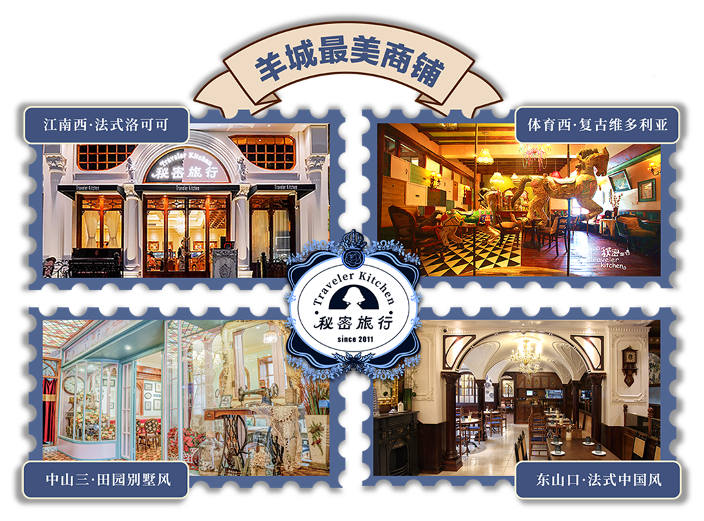
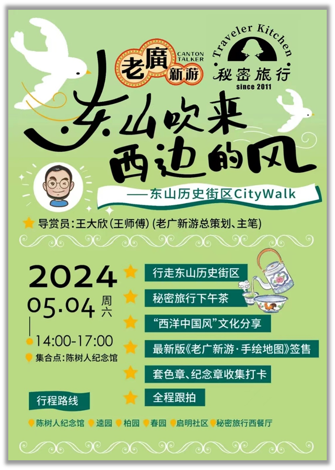

## Situation

项目来源于《服务管理》课程作业

在餐饮业，尤其是在“网红”品牌层出不穷、生命周期普遍较短的当下市场环境中，一个品牌要实现长期可持续经营面临巨大挑战。本项目研究的对象是广州本土西餐品牌——“秘密旅行”餐厅。该品牌自2011年创立以来，已持续经营14年并开设了5家分店，在年轻消费群体中享有高知名度。其最显著的特征是奉行“小而美”的经营哲学与“一店一主题”的差异化模式。本项目旨在探究，“秘密旅行”是如何在竞争激烈的市场中，将这一理念转化为持久的品牌生命力。

## Task

本研究的核心任务是对“秘密旅行”餐厅的经营策略进行系统性、多维度的深度剖析。需要解码其“小而美”理念的内在结构，并验证该理念如何通过具体服务设计与管理实践，有效传递给消费者，最终构筑起稳固的顾客忠诚度与品牌护城河。具体目标包括：
1.  识别并提炼出支撑其可持续经营的核心战略支柱。
2.  通过质性与量化研究，评估这些战略在顾客体验层面的实际效果。
3.  为理解现代服务业中差异化品牌的成功路径提供一个可供参考的实证案例。

## Action

为实现研究目标，我们采用了案例研究方法，并结合了多种数据收集与分析技术，形成了一套综合性的研究方案。

1.  **质性研究 (Qualitative Research)**
    *   **创始人深度访谈**：对品牌主理人进行半结构化访谈，以获取关于品牌创立初衷、核心经营战略及未来发展规划的一手信息。
    *   **顾客深度访谈**：与多位餐厅顾客进行线上及线下的半结构化访谈，深入了解他们对品牌环境、菜品、服务及文化活动的真实感知与体验。
    *   **参与式观察 (On-site Observation)**：在餐厅进行实地调研，以观察员身份记录服务流程、环境细节以及员工与顾客的互动，撰写观察笔记。

2.  **量化分析 (Quantitative Analysis)**
    *   **社交媒体数据分析**：为弥补访谈样本量的局限并扩大分析视野，我们收集了社交媒体平台（小红书、抖音）上关于“秘密旅行”的大量用户评论作为二手数据。
    *   **文本分析技术**：利用Python爬虫工具获取数据，并通过`snownlp`库进行情感倾向分析，使用`jieba`与`wordcloud`库进行词频分析与可视化，从而量化评估公众舆论与品牌感知的关键维度。

3.  **整合分析 (Thematic Analysis)**
    *   对所有收集到的质性数据（访谈录音、观察笔记）采用三阶编码（开放、主轴、核心）的扎根理论方法进行分析，自下而上地提炼出核心主题。最终，我们将所有发现整合进一个统一的分析框架中。

## Result

通过对多源数据的综合分析，我们发现“秘密旅行”的“小而美”战略主要由以下四大支柱构成，且这些战略在顾客端得到了积极的反馈与验证。

#### 1. 打造差异性与独特性 
“秘密旅行”的核心吸引力在于其“一店一主题”模式。每家分店（如维多利亚复古风、法式洛可可风、中式西情风）都提供独一无二的沉浸式空间体验。从创始人访谈中得知，这是刻意为之的非标化战略。顾客访谈与社交媒体词云图均高频出现了“好看”、“氛围”、“拍照”、“打卡”等词汇，证实了其独特的视觉设计与环境氛围是吸引顾客并激发其自发传播的关键驱动力。

#### 2. 保持创新性与灵活性

品牌并未因历史悠久而停滞不前。分析发现其在多个层面保持着高度的创新活力：
*   **菜品迭代**：定期推出季节性新品（如“柿柿如意”蛋糕）和独创菜式（如墨鱼汁意面），满足消费者对新鲜感的追求。
*   **场景更新**：门店会根据节日（如圣诞节、春节）进行主题化装饰，并定期进行整体风格升级，持续创造新颖的体验。
*   **服务灵活**：服务模式被顾客描述为“恰到好处”，既能保证顾客的私密空间，又能在需要时（通过服务铃）迅速响应，体现了服务的灵活性。

#### 3. 追求长期发展与可持续经营 
与追求快速扩张的“网红”品牌不同，“秘密旅行”创始人明确表示其战略是“按自己的步调发展”，将盈利能力和团队建设置于规模扩张之前。这一理念体现在为顾客提供高性价比的产品与服务上。顾客访谈显示，消费者普遍认为其定价合理，品质稳定，这构成了他们愿意重复光顾的基础，从而形成了较高的顾客满意度与忠诚度。

#### 4. 注重客户关系与社区参与 
“秘密旅行”通过线上线下的多元化活动积极构建品牌社区。
* **社群活动**：定期举办CityWalk、主题分享会、艺术展览等活动，将品牌从单纯的餐饮场所延伸为文化生活方式的载体。

  

*   **社会责任**：在疫情期间为医护人员送餐等公益行为，提升了品牌的社会形象和美誉度。

*   **线上互动**：社交媒体情感分析结果显示，其在小红书（0.666）和抖音（0.696）的平均情感倾向得分均显著高于行业平均水平，表明其线上社群氛围健康积极，用户互动良好。词云图中高频出现的“喜欢”、“去过”等词汇也反映了老顾客的高参与度。

## Reflection

“秘密旅行”的成功为现代服务业品牌提供了宝贵的启示。它证明了“小而美”并非仅仅是规模上的小，而是一种聚焦于深度、品质和独特性的战略选择。

其核心经验在于实现了**品牌哲学与服务实践的高度统一**。从宏观的“一店一主题”定位，到微观的菜品创新、定制餐具、灵活服务乃至社群活动，所有触点都精准地传递了“创造美，分享美”的品牌理念。这不仅构建了难以复制的竞争壁垒，也与顾客建立了深厚的情感连接。

最终，“秘密旅行”的案例表明，在信息过载和快速迭代的消费时代，品牌的长久生命力并非源于“大而全”的规模覆盖，而是源于为特定客群创造“小而精”的极致价值。这对于其他试图在激烈竞争中突围的品牌而言，具有重要的借鉴意义。

当然，本研究也存在局限性，如质性访谈的样本量有限，未来可进一步扩大样本范围，或引入更复杂的量化模型进行深入分析。