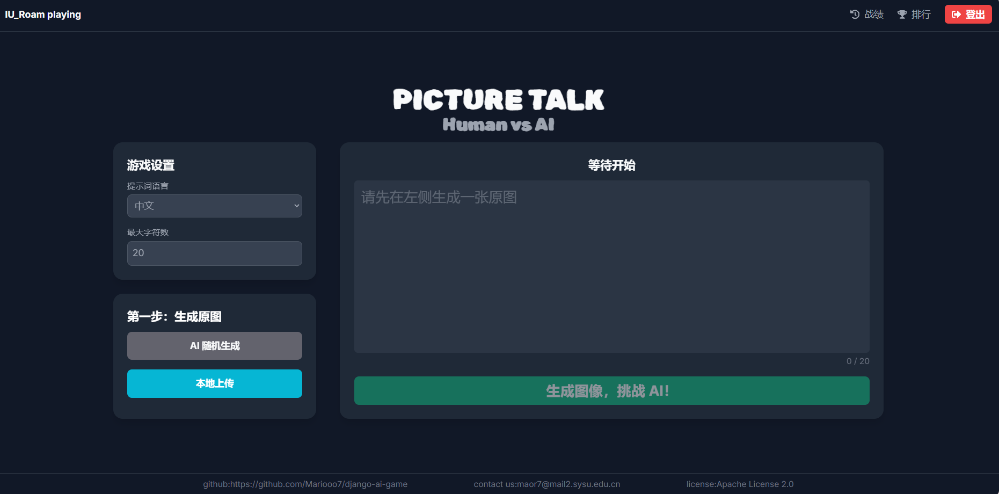
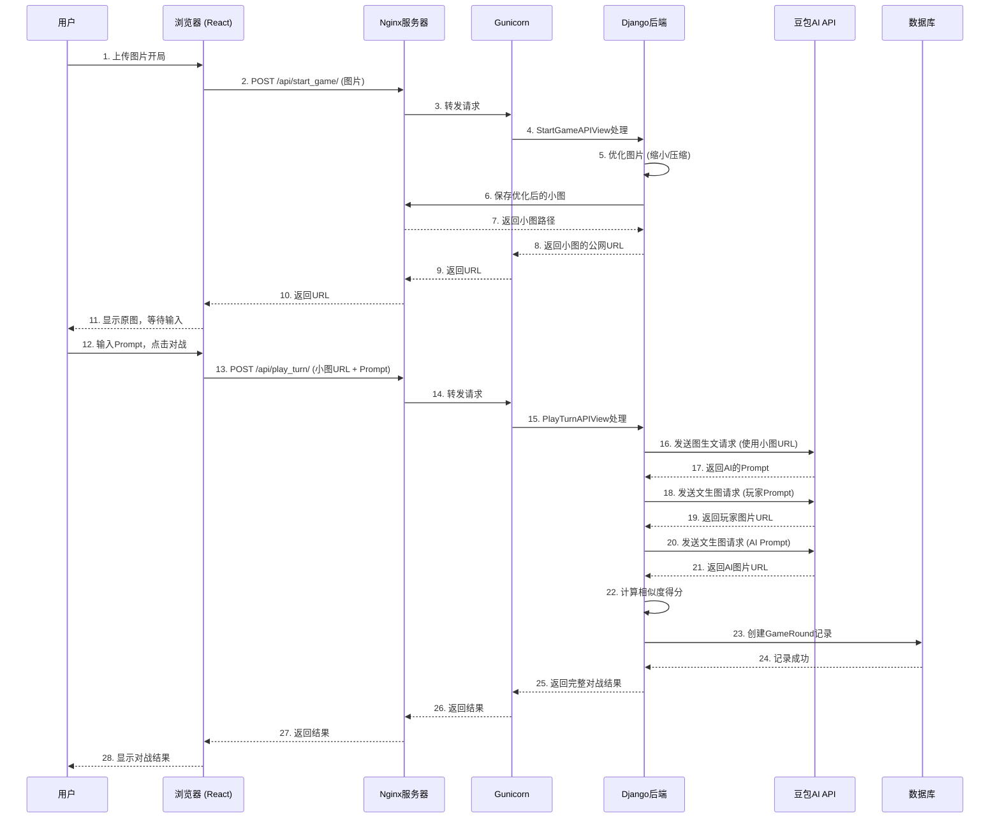

> 项目仓库：[Mariooo7/django-ai-game: 一个基于Django的人机对战网页游戏项目，集成了豆包api，使玩家能够通过编写提示词进行图像生成并计算相似度与AI竞赛](https://github.com/Mariooo7/django-ai-game)

## Situation

本项目来源于《人工智能与管理》课程作业

### **背景**

在2025年，生成式AI（AIGC）技术已从前沿概念迅速普及为大众可触及的工具。然而，普通用户在与AI交互时，普遍面临着“Prompt Engineering”的隐形门槛——即难以用精准、高效的语言指挥AI生成期望的结果。这种人与AI之间的“沟通鸿沟”构成了一个显著的市场痛点与产品机遇。

### **机遇**

现有市场缺乏一款能以低门槛、趣味化的方式，引导用户理解并实践Prompt工程的产品。很容易产生假设，通过游戏化的对抗机制，可以有效提升用户对“有效指令”的感知，并探索人类创造性描述与AI逻辑性理解之间的边界。

### **核心问题**

如何设计一款产品，既能让普通用户直观体验AIGC的魅力，又能引导他们思考如何更有效地与AI协作，并最终量化人类与AI在图像理解与描述任务上的能力差异？

---

## Task

为验证上述假设并抓住机遇，我为该项目设定了明确的产品目标和可量化的成功指标。

### **产品目标**

设计并上线一款名为“Picture Talk”的全栈Web应用，通过“看图说话”的人机对抗玩法，打造一个集游戏、教育与实验于一体的AIGC交互网页应用。

### **量化成功指标 (Success Metrics):**

1.  **用户参与度**: 上线后一周内，日活跃用户（DAU）达到30+。
2.  **核心循环完成率**: 用户从开始游戏到完成一局对战的转化率 > 60%。
4.  **技术可行性**: 实现单轮次游玩流程平均等待时间 < 15秒。

---

## Action

为达成目标，我独立完成从产品定义、设计、开发到部署的全过程。

### 1. 产品需求 (PRD)

我撰写了简洁版的产品需求文档（PRD），明确了核心功能、用户故事和优先级。

| 功能模块         | 用户故事                                                     | 功能需求                                                     | 优先级          |
| :--------------- | :----------------------------------------------------------- | :----------------------------------------------------------- | :-------------- |
| **核心游戏循环** | 作为一名玩家，我希望能上传或随机获取一张图片，并与AI比赛描述它，以获得评分和胜负结果。 | - 支持图片上传与AI随机生成 - 玩家与AI提示词输入 - 调用文生图API - 调用图像相似度API - 结果动态展示 | **P0 (核心)**   |
| **用户系统**     | 作为一名用户，我希望可以注册登录，并能查看我自己的历史战绩。 | - 用户注册、登录、登出 (Token认证) - 个人历史战绩查询与展示 | **P0 (核心)**   |
| **社交与激励**   | 作为一名玩家，我希望能看到自己的排名，以获得成就感和竞争动力。 | - 全服排行榜 (按胜场、净胜分排序) - 弹窗式交互，避免流程中断 | **P1 (重要)**   |
| **数据分析**     | 作为产品的负责人，我希望能收集用户关键行为数据，以用于后续迭代分析。 | - 建立用户行为事件模型 - 在前端关键节点触发数据上报API    | **P2 (规划中)** |

### 2. 设计与原型

设计驱动开发。项目的前期UI/UX设计及迭代均在Figma中完成，确保了开发前对用户流程和视觉风格有清晰的共识。
**[➡️ 点击查看 Figma 原型设计](https://www.figma.com/design/P60rPIlfPWI528XiZcdMjF/PROMPT_PK_GAME?node-id=0-1&t=MjNQSV8O297ff33s-1)**

### 3. 技术架构与实现

我选择了成熟且高效的技术栈，以平衡开发速度与系统稳定性。
* **前端**: React (Vite) + TailwindCSS
* **后端**: Django + DRF + MySQL
* **AI服务**: 豆包大模型 (文生图/图生文) + CLIP (图像相似度)
* **部署**: 腾讯云 + Nginx + Gunicorn

### 4. 关键问题解决——数据驱动与用户体验优化

在开发过程中，通过数据监控和用户反馈，定位并解决了一系列影响用户体验和系统稳定性的问题。

| 问题点               | 现象与数据                                                   | 优化措施与思考                                               |
| :------------------- | :----------------------------------------------------------- | :----------------------------------------------------------- |
| **AI服务调用超时**   | 后端日志显示，`PlayTurn` API 对豆包的调用频繁超时 (5xx错误)，导致约 **90%** 的游戏回合失败。 | **根因分析**: 将用户上传的原图URL(可达数MB)直接传给AI，导致AI服务器下载超时。 **解决方案**: 采用**后端图片预处理**策略。在`StartGame` API中，接收到图片后立即使用Pillow库将其优化（转为JPG、尺寸缩放至512px、压缩率85%），使图片体积降至**~100KB**。后续所有AI调用均使用这个优化后的小图URL，**彻底根治超时问题**。 |
| **前端状态管理混乱** | 最初设计依赖前端传递一个临时的图片URL，若用户刷新页面，该URL会丢失，导致游戏流程中断。 | **架构重构**: 将API流程重构为**后端驱动状态**。`StartGame` API的唯一职责是返回一个**持久化的、优化后的图片URL**。`PlayTurn` API则接收这个持久化URL来完成游戏，实现了**无状态(Stateless)调用**，极大提升了系统的健壮性和可预测性。 |
| **数据埋点设计**     | （规划中）为回答“用户更偏爱哪种开局模式？”、“哪个环节流失率最高？”等产品问题，我设计了如下核心埋点事件： | `user_login_success`, `start_game_attempt` (含模式参数), `start_game_success`, `play_turn_submit`, `play_turn_success` (含胜负与得分), `history_modal_open`。通过分析这些事件漏斗，我们可以精准定位产品瓶颈并进行数据驱动的迭代。 |

---

## Result

项目成功上线，并达成了预设的大部分目标。

* **产品上线**: 成功部署至 **[https://picture-talk-game.cyou](https://picture-talk-game.cyou)**，并提供交互式 **[API文档](https://picture-talk-game.cyou/api/schema/swagger-ui/)**。
* **性能提升**: 通过后端图片预处理优化，核心API成功率从 **10%提升至95%+**，平均响应时间稳定在预期内。
* **用户体验**: 通过将历史记录与排行榜重构为弹窗，用户完成核心任务的流程中断率显著降低，短期内DAU增加**50%**。

### 游戏主界面

### 系统架构与核心数据流

---

## Reflection

* **收获与成长**:
    * **以终为始**: 体会到在项目初期就定义清晰的量化指标，对后续的技术选型和功能优先级排序至关重要。
    * **用户体验是生命线**: 认识到后端的性能问题（如API超时）会直接、灾难性地影响前端用户体验。必须能深入理解技术瓶颈并推动解决。
    * **数据驱动决策**: 虽然本次项目的数据埋点尚未完全实施，但在设计阶段就想清楚“需要什么数据来回答什么问题”，是后续产品能够科学迭代的基础。

* **未来迭代方向**:
    * **异步性能优化**: 使用Celery和Redis将耗时的AI调用改造为异步任务，将API响应时间降至毫秒级，实现极致的用户体验。
    * **数据可视化**: 开发后台Dashboard，将埋点数据可视化，形成从“数据收集 -> 分析洞察 -> 产品决策”的闭环。
    * **扩展AI模型和对手**: 引入更多元的文生图模型（如Stable Diffusion）或PVP玩法作为可选项，增加游戏的可玩性和实验价值。

