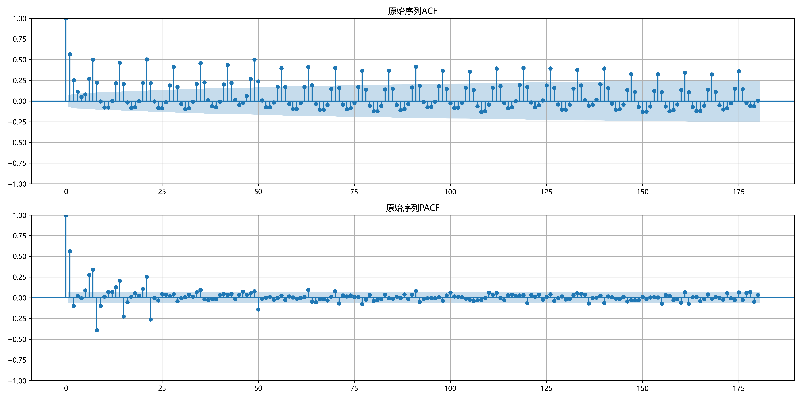
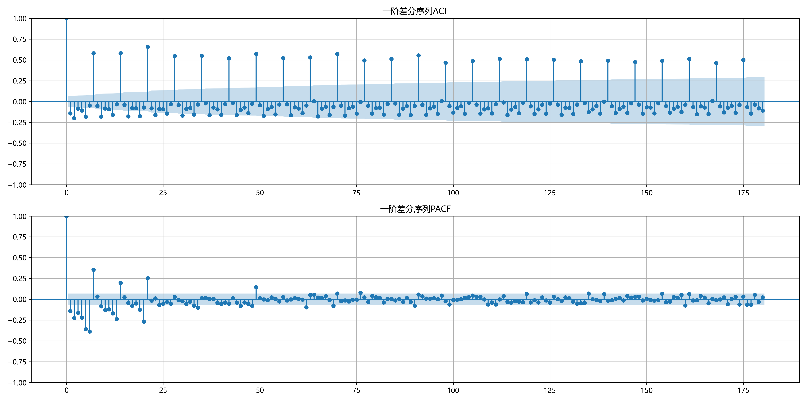
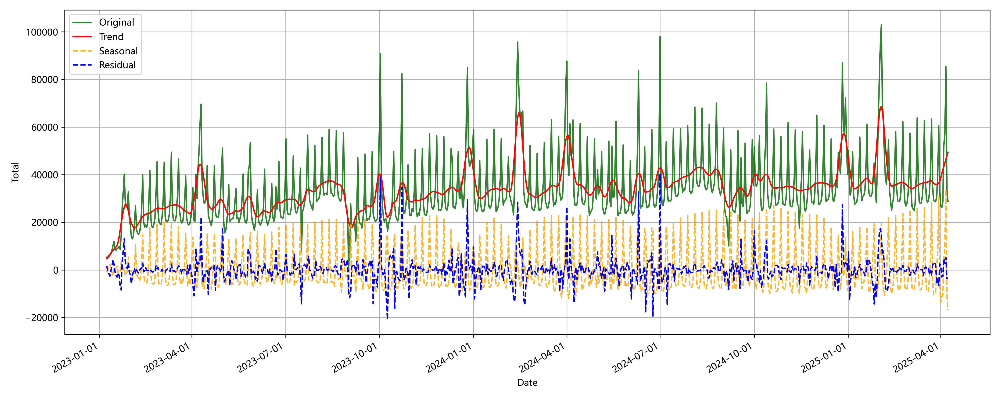
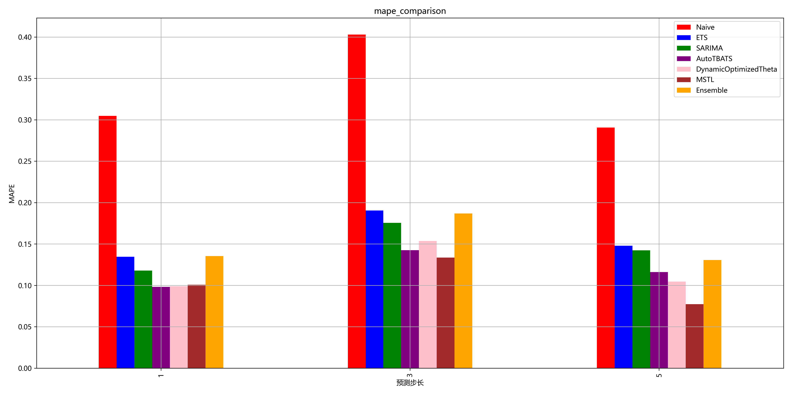
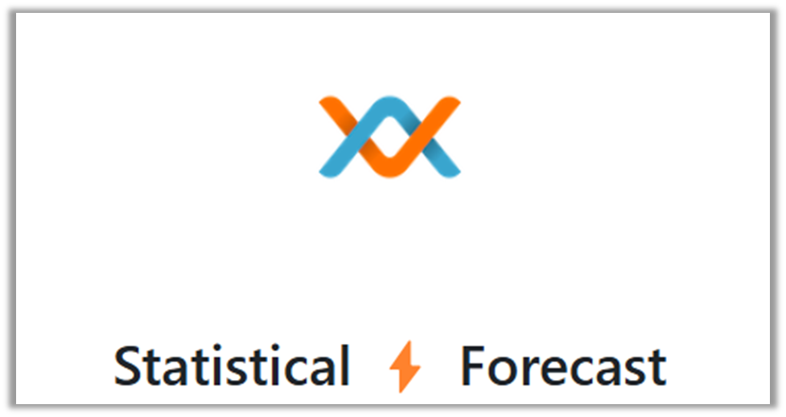
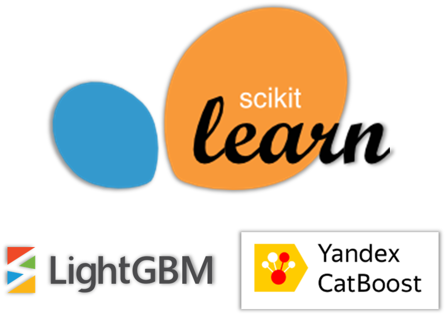
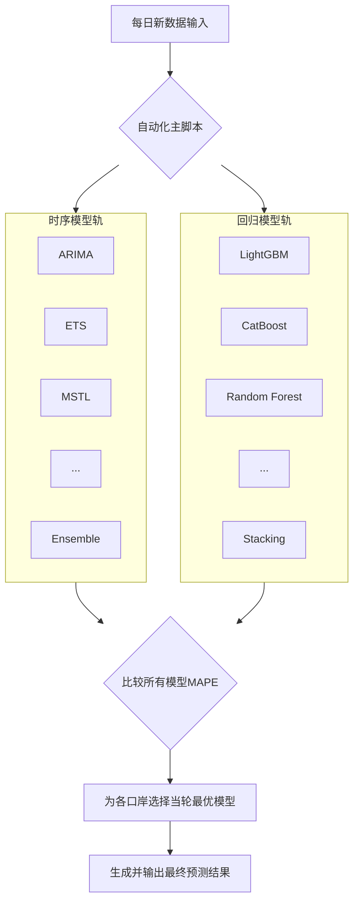

## Situation

本项目来源于“旅游大数据预测”课程竞赛，主题是解决一个动态且复杂的真实预测问题：**为香港五大口岸精准预测未来五日的入境游客量**，并每日进行当日轮次的预测结果提交用于评分。

这模拟了真实的业务环境：

1. 数据每日动态更新

2. 要求模型能够快速响应

3. 目标是持续输出高精度预测 

这不仅考验算法精度，更考验整个预测流程的**自动化、鲁棒性与可扩展性**。

## Task 

考虑到以上情况，设定项目的目标为：**设计并交付一个自动化系统**。

即，该系统的目标并非是一次性的预测，而是要在每一轮（每一天）获取新数据后，能为**每一个口岸**独立地、自动化地完成“数据处理 -> 模型训练 -> 性能评估 -> 最优模型选择 -> 输出结果”的完整闭环，以实现持续、稳定的高精度预测。

## Action 

为实现这一目标，整体行动方案被分解为四个逻辑清晰、环环相扣的步骤。

### 步骤一：探索性数据分析 (EDA) - 获得数据洞察辅助制定策略

在开始建模之前，首先对每个口岸的历史数据进行了深入的探索性分析。这一步的目标是从数据中发掘规律，为后续的策略制定提供实证依据。

**主要发现**:

1. **强烈的周期性**: 所有口岸的客流都呈现以7天为单位的规律性波动。通过ACF（自相关）图可以清晰看到，相关性在滞后7、14、21天等位置出现显著峰值 。

2. **趋势与非平稳性**: 原始序列通常包含长期趋势，并非平稳序列。一阶差分后的ACF/PACF图显示出更好的平稳性，为后续模型选型提供了参考 。

   罗湖口岸 ACF与PACF 图
   
   

3. **外部因素的潜在关联**: 初步分析发现，天气、汇率，甚至网络热度等外部信息，都可能对游客的出行决策产生影响。

这些发现直接决定了项目的技术方向：**一个成功的预测模型，必须有能力同时处理周期性、趋势性，并有效融合外部变量。**

罗湖口岸 季节性分解

同时在探索性分析中也简单试验了待选用的一些时序模型在设定不同滑动窗口长度下的精度表现，为后续设定预测步长提供参考：

---

### 步骤二：特征工程与筛选 - 将洞察转化为效益

基于EDA的发现，项目最初构建了一个包含超过160个特征的多维度特征矩阵 。

1.  **特征构建**:
    
    * **核心特征**: 包括捕捉时间惯性的**滞后(Lag)**特征、反映近期趋势的**滑动(Rolling)**特征、量化**节假日效应**的事件特征，以及融合了**汇率、百度指数、降雨量**的外部信号特征 。

    * **实验与迭代**: 项目还尝试引入了由大语言模型生成的“重大事件”数据，但经测试发现其对模型性能提升不佳，最终在后续预测中被移除 ，这体现了**基于实证、快速迭代**的开发原则。

特征变量表

| 处理方法类别 | 特征名称 | 特征描述 |
| :--- | :--- | :--- |
| 时间基础特征 | `year`, `month`, `day`, `weekday`, `quarter`, `is_weekend` | 提取日期元素（年/月/日/星期/季度） |
| 节假日标记 | `is_hk_holiday`, `is_cn_holiday` | 标记香港/中国法定节假日 |
| 节假日衍生特征 | `post_hk_holiday`, `post_cn_holiday`, `hk_weekend_holiday`, `cn_weekend_holiday` | 滞后节假日标记、周末与节假日交互 |
| 汇率处理 | `ex`, `ex_rate_lag_5/7/14`, `ex_rate_change_14d`, `ex_rate_volatility_7d` | 汇率原始值、滞后值、14天变化、7天波动 |
| 百度指数聚合特征 | `baidu_sum`, `baidu_pc`, `baidu_mobile`, `pc_mobile` | 总搜索量、PC/移动端聚合、设置移动端比率 |
| 游客量滞后特征 | `lag_1` ~ `lag_30` | 游客量历史值（1-30天滞后） |
| 百度指数滞后特征 | `(col)_lag_5/7/14`（如 `hk_sum_lag_7`） | 百度各维度搜索指数滞后（5/7/14天） |
| 游客量变化特征 | `total_change_7d`, `total_change_14d` | 游客量7天/14天差值 |
| 滚动统计量 | `rolling_7/30_mean`, `rolling_7_std`, `ma_ratio_7_30` | 游客量7天/30天均值、7天标准差、均线比 |
| 周期特征 | `month_sin` | 傅里叶变换提取月度周期性 |
| 趋势特征 | `days_since_start`, `days_squared` | 线性/非线性时间趋势项 |
2.  **特征筛选**:
    - **思考**: 并非所有特征都是有益的，过多的特征可能导致模型过拟合。

    - **实践**: 项目设计了特征筛选实验，比较了使用全部特征（Full Models）与仅保留累积重要性Top 90%/80%的特征子集对模型性能的影响。实验证明，对于大部分口岸，使用简化后的特征子集能取得更好或相当的性能，从而能在坚持自动化的原则同时实现模型的轻量化 。

round 7 特征筛选效果对比

| 口岸 | Full Models (MAPE) | Round7 (累积90%重要性) | Round7_Simple (累积80%重要性) | 最佳策略 |
| :--- | :--- | :--- | :--- | :--- |
| 香港国际机场 | 0.0485 | 0.0474 | **0.0458** | Round7_Simple |
| 港珠澳大桥 | 0.0804 | **0.0737** | 0.0748 | Round7 |
| Lo Wu | 0.0751 | 0.0729 | **0.0665** | Round7_Simple |
| Lok Ma Chau Spur Line | 0.0767 | 0.0701 | **0.0674** | Round7_Simple |
| 深圳湾 | 0.0955 | 0.0916 | **0.0901** | Round7_Simple |

---

### 步骤三：构建标准化的“双轨模型候选池”

为了能自动化地比较和选择模型，项目利用了两个具有**统一接口**的Python库，搭建了两条并行的技术路径。这种标准化的设计，极大地简化了自动化脚本的编写。

1.  **时序模型轨 (基于 `statsforecast` 库)**:
    * 该库的优势在于其统一的API。无论是`AutoARIMA`还是`MSTL`，都遵循相同的调用方式 ，使得在一个循环中就能完成对多种复杂时序模型的统一训练和评估。

1. **回归模型轨 (基于 `scikit-learn` 兼容接口)**:

   * 利用梯度提升树模型（如`LightGBM`, `CatBoost`）处理高维特征的优势。通过将所有模型封装在统一的字典结构中，实现了脚本化的统一管理 ，并为Stacking模型融合提供了便利。

   

---

### 步骤四：实现自动化流程

这个自动化框架，成功地将一个需要大量人工干预的复杂数据科学任务，转化为了一个**高效、可靠、可复现的工程流程**。

## Result

- 实现了高精度的预测：系统最终在五个口岸上均取得了理想的预测效果，其中香港国际机场的MAPE低至4.02%，最高不超过10%

- 交付了可靠的自动化系统：最终成果并非一次性的预测脚本，而是一个能够持续运行、自我优化的预测系统。它能在不同阶段为不同口岸动态地匹配最优模型，展现了强大的适应性。

  round 8 模型选用和及其精度

  | **口岸名称**  (Port  Name)          | **最小MAPE  (Minimum MAPE)** | **对应模型**   **(Corresponding Model)** |
  | ----------------------------------- | ---------------------------- | ---------------------------------------- |
  | **Hong Kong International Airport** | 0.0402                       | **MSTL（step=1）**                       |
  | **Hong Kong-Zhuhai-Macao Bridge**   | 0.0759                       | **Stacking  (Adjusted-0.8)**             |
  | **Lo Wu**                           | 0.0654                       | **LGBM  (Original-0.8)**                 |
  | **Lok Ma Chau Spur Line**           | 0.0742                       | **CatBoost**  **(Original-0.8)**         |
  | **Shenzhen Bay**                    | 0.0866                       | **CatBoost**  **(Adjusted-0.8)**         |

- **锻炼了了端到端的工程化解题能力**：本项目包含了从**业务理解、数据探索、架构设计、技术实现到自动化交付**的全栈能力，积累了将数据科学项目落地为可靠解决方案的实践经验。

## Reflection

1. **特征工程的深度**: 虽然本项目已构建了较丰富的特征体系，但仍有探索空间。例如，可以引入更细粒度的事件数据（如特定演唱会、展览的日期），或更宏观的经济指标，并采用更复杂的特征交叉方法，观察其对模型性能的影响。
2. **模型融合策略**: 目前机器学习部分使用了Stacking，未来可以探索更多样的Ensemble策略，比如将统计模型的预测结果也作为一部分特征输入到Stacking的元模型中，实现跨技术栈的深度融合。
3. **工程化部署**: 本项目实现了自动化的脚本流程。未来的工作可以将此系统封装成一个可以通过API调用的服务，并增加模型监控、自动告警等生产环境所需的功能。